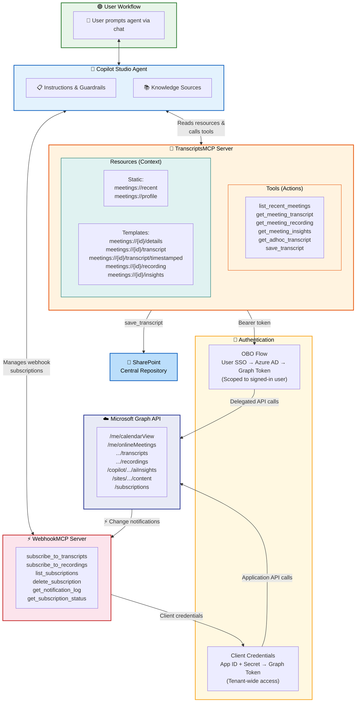
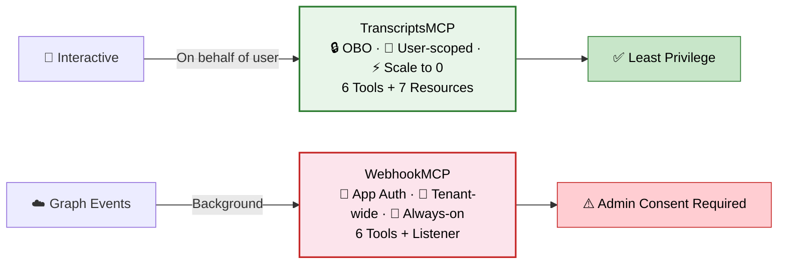
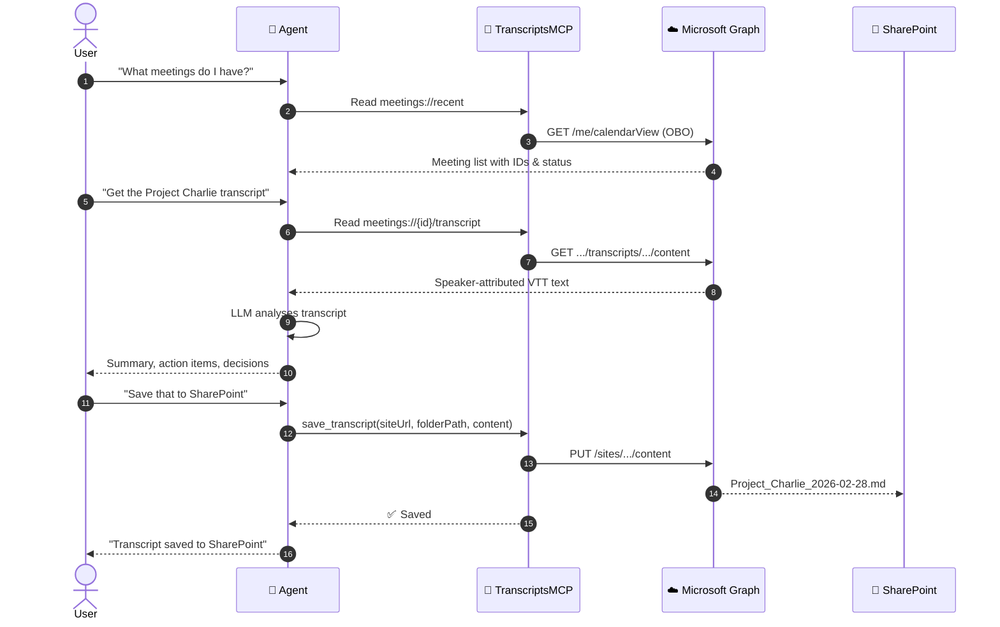
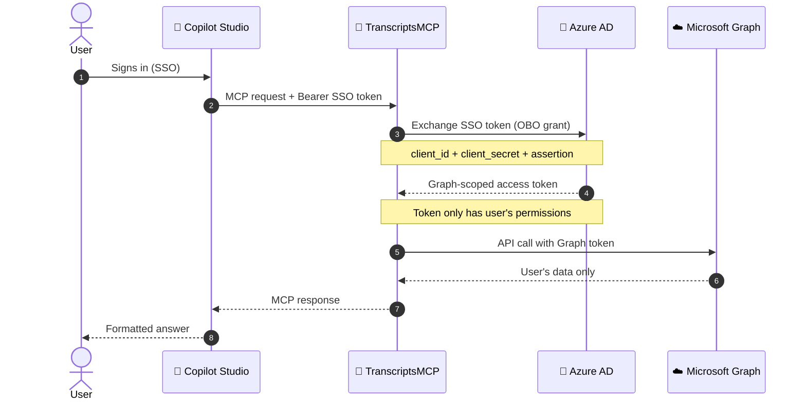

# TranscriptsMCP — Architecture Overview

## System Architecture

```mermaid
graph TD
    subgraph USER["🟢 User Workflow"]
        U["👤 User prompts agent via chat"]
    end

    subgraph AGENT["🤖 Copilot Studio Agent"]
        direction TB
        INSTRUCTIONS["📋 Instructions & Guardrails"]
        KNOWLEDGE["📚 Knowledge Sources"]
    end

    subgraph MCP["🔧 TranscriptsMCP Server"]
        direction TB
        subgraph TOOLS_GROUP["Tools (Actions)"]
            TOOLS["list_recent_meetings\nget_meeting_transcript\nget_meeting_recording\nget_meeting_insights\nget_adhoc_transcript\nsave_transcript"]
        end
        subgraph RESOURCES_GROUP["Resources (Context)"]
            STATIC["Static:\nmeetings://recent\nmeetings://profile"]
            TEMPLATES["Templates:\nmeetings://{id}/details\nmeetings://{id}/transcript\nmeetings://{id}/transcript/timestamped\nmeetings://{id}/recording\nmeetings://{id}/insights"]
        end
    end

    subgraph WEBHOOK["⚡ WebhookMCP Server"]
        W_TOOLS["subscribe_to_transcripts\nsubscribe_to_recordings\nlist_subscriptions\ndelete_subscription\nget_notification_log\nget_subscription_status"]
    end

    subgraph AUTH["🔐 Authentication"]
        OBO["OBO Flow\nUser SSO → Azure AD → Graph Token\n(Scoped to signed-in user)"]
        APP["Client Credentials\nApp ID + Secret → Graph Token\n(Tenant-wide access)"]
    end

    subgraph GRAPH["☁️ Microsoft Graph API"]
        G_ENDPOINTS["/me/calendarView\n/me/onlineMeetings\n.../transcripts\n.../recordings\n/copilot/.../aiInsights\n/sites/.../content\n/subscriptions"]
    end

    SP["💾 SharePoint\nCentral Repository"]

    U <--> AGENT
    AGENT <-->|"Reads resources &\ncalls tools"| MCP
    AGENT <-->|"Manages webhook\nsubscriptions"| WEBHOOK
    MCP -->|"Bearer token"| OBO
    WEBHOOK -->|"Client credentials"| APP
    OBO -->|"Delegated API calls"| GRAPH
    APP -->|"Application API calls"| GRAPH
    GRAPH -->|"⚡ Change notifications"| WEBHOOK
    MCP -->|"save_transcript"| SP

    style USER fill:#e8f5e9,stroke:#2e7d32,stroke-width:2px,color:#000
    style AGENT fill:#e3f2fd,stroke:#1565c0,stroke-width:2px,color:#000
    style MCP fill:#fff3e0,stroke:#e65100,stroke-width:2px,color:#000
    style WEBHOOK fill:#fce4ec,stroke:#c62828,stroke-width:2px,color:#000
    style AUTH fill:#fff8e1,stroke:#f9a825,stroke-width:2px,color:#000
    style GRAPH fill:#e8eaf6,stroke:#283593,stroke-width:2px,color:#000
    style SP fill:#bbdefb,stroke:#1565c0,stroke-width:2px,color:#000
    style TOOLS_GROUP fill:#fff3e0,stroke:#e65100,stroke-width:1px,color:#000
    style RESOURCES_GROUP fill:#e0f2f1,stroke:#00695c,stroke-width:1px,color:#000
```

## Two Servers — Why Separate?

```mermaid
graph LR
    USER["👤 Interactive"] -->|"On behalf of user"| DEL
    EVENTS["☁️ Graph Events"] -->|"Background"| WEB

    DEL["TranscriptsMCP\n🔒 OBO · 👤 User-scoped · ⚡ Scale to 0\n6 Tools + 7 Resources"] --> SAFE["✅ Least Privilege"]
    WEB["WebhookMCP\n🔑 App Auth · 🏢 Tenant-wide · 🔄 Always-on\n6 Tools + Listener"] --> ELEVATED["⚠️ Admin Consent Required"]

    style DEL fill:#e8f5e9,stroke:#2e7d32,stroke-width:2px,color:#000
    style WEB fill:#fce4ec,stroke:#c62828,stroke-width:2px,color:#000
    style SAFE fill:#c8e6c9,stroke:#2e7d32,color:#000
    style ELEVATED fill:#ffcdd2,stroke:#c62828,color:#000
```

## Agent Workflow

```mermaid
sequenceDiagram
    autonumber
    actor User
    participant Agent as 🤖 Agent
    participant MCP as 🔧 TranscriptsMCP
    participant Graph as ☁️ Microsoft Graph
    participant SP as 💾 SharePoint

    User->>Agent: "What meetings do I have?"
    Agent->>MCP: Read meetings://recent
    MCP->>Graph: GET /me/calendarView (OBO)
    Graph-->>Agent: Meeting list with IDs & status

    User->>Agent: "Get the Project Charlie transcript"
    Agent->>MCP: Read meetings://{id}/transcript
    MCP->>Graph: GET .../transcripts/.../content
    Graph-->>Agent: Speaker-attributed VTT text

    Agent->>Agent: LLM analyses transcript
    Agent-->>User: Summary, action items, decisions

    User->>Agent: "Save that to SharePoint"
    Agent->>MCP: save_transcript(siteUrl, folderPath, content)
    MCP->>Graph: PUT /sites/.../content
    Graph-->>SP: Project_Charlie_2026-02-28.md
    MCP-->>Agent: ✅ Saved
    Agent-->>User: "Transcript saved to SharePoint"
```

## OBO Authentication Flow

```mermaid
sequenceDiagram
    autonumber
    actor User
    participant Copilot as 🤖 Copilot Studio
    participant MCP as 🔧 TranscriptsMCP
    participant AAD as 🔐 Azure AD
    participant Graph as ☁️ Microsoft Graph

    User->>Copilot: Signs in (SSO)
    Copilot->>MCP: MCP request + Bearer SSO token
    MCP->>AAD: Exchange SSO token (OBO grant)
    Note over MCP,AAD: client_id + client_secret + assertion
    AAD-->>MCP: Graph-scoped access token
    Note over AAD,MCP: Token only has user's permissions
    MCP->>Graph: API call with Graph token
    Graph-->>MCP: User's data only
    MCP-->>Copilot: MCP response
    Copilot-->>User: Formatted answer
```
