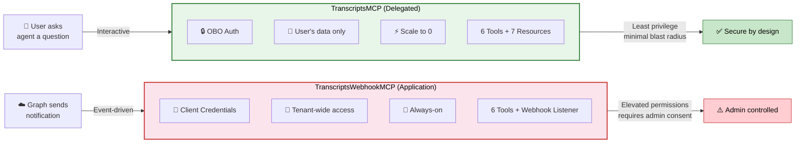
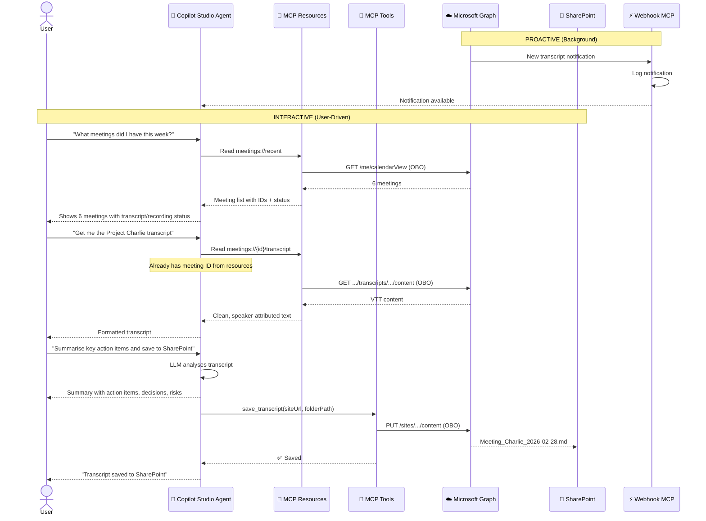

# TranscriptsMCP — Architecture Overview

## System Architecture

```mermaid
graph TB
    subgraph USER["🟢 USER WORKFLOW"]
        U1["Step 1\n'What meetings do\nI have?'"]
        U2["Step 2\n'Get me the\ntranscript for X'"]
        U3["Step 3\n'Save it to\nSharePoint'"]
        U4["Step 4\n'Create a summary\nreport'"]
    end

    U1 -->|Calls| AGENT
    U2 -->|Calls| AGENT
    U3 -->|Calls| AGENT
    U4 -->|"Analyses transcript\nthen calls"| AGENT

    subgraph AGENT["🤖 MEETING INTELLIGENCE AGENT (Copilot Studio)"]
        subgraph TOOLS["🔧 Tools (MCP Servers)"]
            subgraph DELEGATED["TranscriptsMCP\n(Delegated / OBO)"]
                T1["list_recent_meetings"]
                T2["get_meeting_transcript"]
                T3["get_meeting_recording"]
                T4["get_meeting_insights"]
                T5["get_adhoc_transcript"]
                T6["save_transcript"]
            end

            subgraph WEBHOOK["TranscriptsWebhookMCP\n(Application / Always-On)"]
                W1["subscribe_to_transcripts"]
                W2["subscribe_to_recordings"]
                W3["list_subscriptions"]
                W4["delete_subscription"]
                W5["get_notification_log"]
                W6["get_subscription_status"]
            end
        end

        subgraph RESOURCES["📂 MCP Resources (Context)"]
            R1["meetings://recent\nMeeting list with\ntranscript & recording status"]
            R2["meetings://profile\nSigned-in user identity"]
            R3["meetings://{id}/transcript\nClean speaker-attributed text"]
            R4["meetings://{id}/recording\nRecording metadata & URL"]
            R5["meetings://{id}/insights\nAI summaries & action items"]
            R6["meetings://{id}/details\nMeeting metadata"]
        end

        subgraph KNOWLEDGE["📚 Knowledge"]
            K1["SharePoint repositories"]
            K2["Company docs &\nproduct info"]
            K3["Meeting templates"]
        end

        subgraph INSTRUCTIONS["📋 Instructions"]
            I1["Agent persona &\nworkflow"]
            I2["Sales lens analysis"]
            I3["Formatting &\noutput rules"]
            I4["Guardrails —\nno fabrication"]
            I5["SharePoint site\nconfiguration"]
        end
    end

    subgraph AUTH["🔐 AUTHENTICATION"]
        subgraph OBO["Delegated (OBO Flow)"]
            A1["User's SSO Token\n+ Client Secret"]
            A2["Azure AD validates\nuser + app identity"]
            A3["Graph token scoped\nto signed-in user only"]
        end
        subgraph APPAUTH["Application (Client Credentials)"]
            A4["Client ID +\nClient Secret"]
            A5["Azure AD validates\napp identity"]
            A6["Graph token with\ntenant-wide access"]
        end
    end

    DELEGATED -->|"Bearer token"| A1
    A1 --> A2
    A2 --> A3
    A3 -->|"GET /me/..."| GRAPH

    WEBHOOK -->|"Client credentials"| A4
    A4 --> A5
    A5 --> A6
    A6 -->|"POST /subscriptions"| GRAPH

    subgraph GRAPH["☁️ MICROSOFT GRAPH API"]
        G1["/me/calendarView"]
        G2["/me/onlineMeetings"]
        G3[".../transcripts"]
        G4[".../recordings"]
        G5["/copilot/.../aiInsights"]
        G6["/sites/.../content"]
        G7["/subscriptions"]
        G8["/communications/\nonlineMeetings/\ngetAllTranscripts"]
    end

    subgraph EVENTS["⚡ EVENT-DRIVEN (Webhooks)"]
        E1["New transcript\navailable"]
        E2["New recording\navailable"]
        E3["Subscription\nlifecycle"]
    end

    GRAPH -->|"Change notification"| E1
    GRAPH -->|"Change notification"| E2
    GRAPH -->|"Lifecycle event"| E3
    E1 -->|"POST /notifications"| WEBHOOK
    E2 -->|"POST /notifications"| WEBHOOK
    E3 -->|"POST /notifications"| WEBHOOK

    subgraph OUTPUTS["📊 OUTPUTS"]
        O1["📋 Meeting List\n• Subject\n• Date/Time\n• Transcript status\n• Recording status"]
        O2["📝 Transcript Summary\n• Sentiment\n• Action Items\n• Decisions\n• Risks\n• Next Steps"]
        O3["🎥 Recording\n• Metadata\n• Download URL\n• Duration"]
        O4["🔔 Notifications\n• Auto-triggered\n• New transcripts\n• New recordings"]
    end

    T1 --> O1
    T2 --> O2
    T3 --> O3
    W5 --> O4

    O1 -->|"Context for\nnext step"| AGENT
    O2 -->|"Raw transcript\nauto-saved"| SP
    O4 -->|"Proactive\nprocessing"| AGENT

    subgraph SP["💾 SHAREPOINT CENTRAL REPOSITORY"]
        SP1["Meeting Transcripts/"]
        SP2["Meeting_Name_2026-02-28.md"]
        SP3["Organised by date/project"]
    end

    T6 -->|"Saved"| SP

    style USER fill:#e8f5e9,stroke:#2e7d32,stroke-width:2px,color:#000
    style AGENT fill:#e3f2fd,stroke:#1565c0,stroke-width:3px,color:#000
    style TOOLS fill:#f3e5f5,stroke:#7b1fa2,stroke-width:2px,color:#000
    style DELEGATED fill:#fff3e0,stroke:#e65100,stroke-width:2px,color:#000
    style WEBHOOK fill:#fce4ec,stroke:#c62828,stroke-width:2px,color:#000
    style RESOURCES fill:#e0f2f1,stroke:#00695c,stroke-width:2px,color:#000
    style KNOWLEDGE fill:#f5f5f5,stroke:#616161,stroke-width:1px,color:#000
    style INSTRUCTIONS fill:#f5f5f5,stroke:#616161,stroke-width:1px,color:#000
    style AUTH fill:#fff8e1,stroke:#f9a825,stroke-width:2px,color:#000
    style OBO fill:#fff8e1,stroke:#f9a825,stroke-width:1px,color:#000
    style APPAUTH fill:#fff8e1,stroke:#f9a825,stroke-width:1px,color:#000
    style GRAPH fill:#e8eaf6,stroke:#283593,stroke-width:2px,color:#000
    style EVENTS fill:#fff3e0,stroke:#e65100,stroke-width:2px,color:#000
    style OUTPUTS fill:#e8f5e9,stroke:#2e7d32,stroke-width:2px,color:#000
    style SP fill:#bbdefb,stroke:#1565c0,stroke-width:2px,color:#000
```

## Two-Server Architecture: Why Separate?

```mermaid
graph LR
    subgraph DELEGATED_SERVER["TranscriptsMCP (Delegated)"]
        DS1["🔒 OBO Auth"]
        DS2["👤 User's data only"]
        DS3["⚡ Scale to 0"]
        DS4["6 Tools + 7 Resources"]
    end

    subgraph WEBHOOK_SERVER["TranscriptsWebhookMCP (Application)"]
        WS1["🔑 Client Credentials"]
        WS2["🏢 Tenant-wide access"]
        WS3["🔄 Always-on"]
        WS4["6 Tools + Webhook Listener"]
    end

    USER["👤 User asks\nagent a question"] -->|"Interactive"| DELEGATED_SERVER
    GRAPH_EVENT["☁️ Graph sends\nnotification"] -->|"Event-driven"| WEBHOOK_SERVER

    DELEGATED_SERVER -->|"Least privilege\nminimal blast radius"| SAFE["✅ Secure by design"]
    WEBHOOK_SERVER -->|"Elevated permissions\nrequires admin consent"| ELEVATED["⚠️ Admin controlled"]

    style DELEGATED_SERVER fill:#e8f5e9,stroke:#2e7d32,stroke-width:2px,color:#000
    style WEBHOOK_SERVER fill:#fce4ec,stroke:#c62828,stroke-width:2px,color:#000
    style SAFE fill:#c8e6c9,stroke:#2e7d32,color:#000
    style ELEVATED fill:#ffcdd2,stroke:#c62828,color:#000
```

## Agent Workflow: End-to-End

```mermaid
sequenceDiagram
    actor User
    participant Agent as 🤖 Copilot Studio Agent
    participant Resources as 📂 MCP Resources
    participant Tools as 🔧 MCP Tools
    participant Graph as ☁️ Microsoft Graph
    participant SP as 💾 SharePoint
    participant Webhook as ⚡ Webhook MCP

    Note over Webhook,Graph: PROACTIVE (Background)
    Graph->>Webhook: New transcript notification
    Webhook->>Webhook: Log notification
    Webhook-->>Agent: Notification available

    Note over User,SP: INTERACTIVE (User-Driven)
    User->>Agent: "What meetings did I have this week?"
    Agent->>Resources: Read meetings://recent
    Resources->>Graph: GET /me/calendarView (OBO)
    Graph-->>Resources: 6 meetings
    Resources-->>Agent: Meeting list with IDs + status
    Agent-->>User: Shows 6 meetings with transcript/recording status

    User->>Agent: "Get me the Project Charlie transcript"
    Agent->>Resources: Read meetings://{id}/transcript
    Note over Agent: Already has meeting ID from resources
    Resources->>Graph: GET .../transcripts/.../content (OBO)
    Graph-->>Resources: VTT content
    Resources-->>Agent: Clean, speaker-attributed text
    Agent-->>User: Formatted transcript

    User->>Agent: "Summarise key action items and save to SharePoint"
    Agent->>Agent: LLM analyses transcript
    Agent-->>User: Summary with action items, decisions, risks
    Agent->>Tools: save_transcript(siteUrl, folderPath)
    Tools->>Graph: PUT /sites/.../content (OBO)
    Graph-->>SP: Meeting_Charlie_2026-02-28.md
    Tools-->>Agent: ✅ Saved
    Agent-->>User: "Transcript saved to SharePoint"
```
